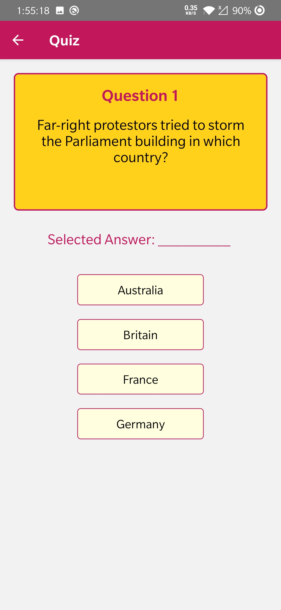
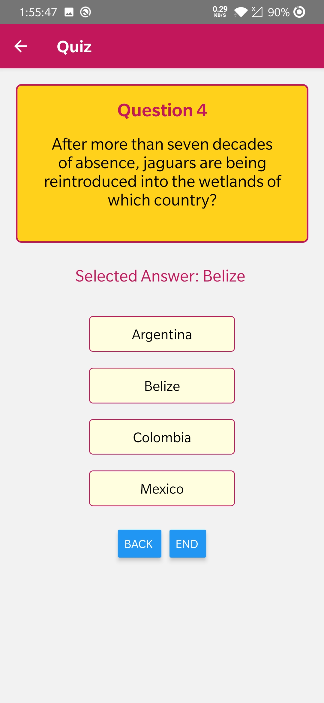

# Quiz App (React-Native)

<table>
<tr>
<td>
<strong>Standard Quiz App developed with React Native</strong>
</td>
</tr>
</table>

## Features

* Saves user information with Shared preferences and shows that on app restart
* Saves quiz score in a file, so when user restarts the app, he/she can check the previous score
* User can revisit the question and change the answer
* User friendly design

## Requirements

- React Native
- Either VS Code or Android Studio

## Setup 

- Install React Native
- clone the repo 
- Start terminal and write command  <code>react-native run-android </code>and run app on your plugged phone/Android Emulator

## Screenshots

<table>
  <tr>
    <td>User Form</td>
    <td>Save Details in Shared Preferences</td>
    <td>Quiz question</td>
  </tr>
  <tr>
    <td valign="top"></td>
    <td valing="top"></td>
    <td valing="top"></td>
  </tr>
  <tr>
    <td>Show next on selecting option</td>
    <td>Can go to prev question</td>
    <td>Show end on last question</td>
  </tr>
  <tr>
    <td valign="top"></td>
    <td valign="top"></td>
    <td valign="top"></td>
  </tr>
  <tr>
    <td>Redirect to Home Screen & Show score</td>
    <td>Show score and User profile on app restart</td>
  </tr>
  <tr>
    <td valign="top"></td>
    <td valign="top"></td>
  </tr>
 </table>

  
 

